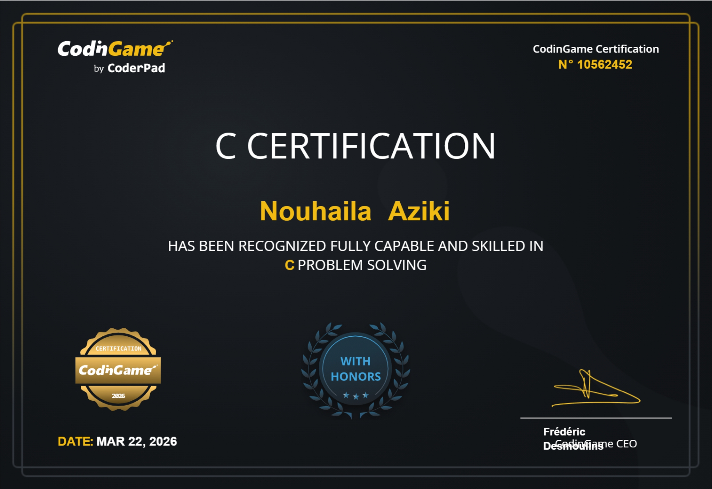
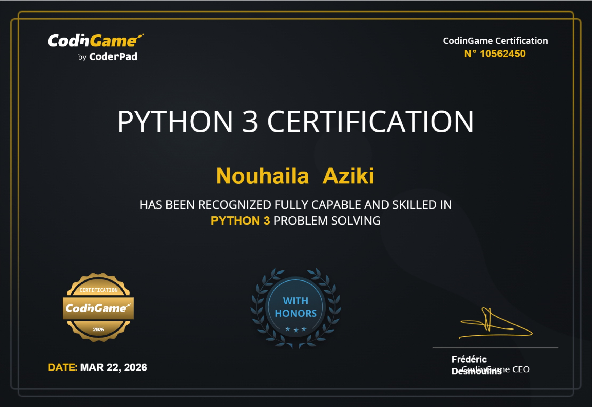
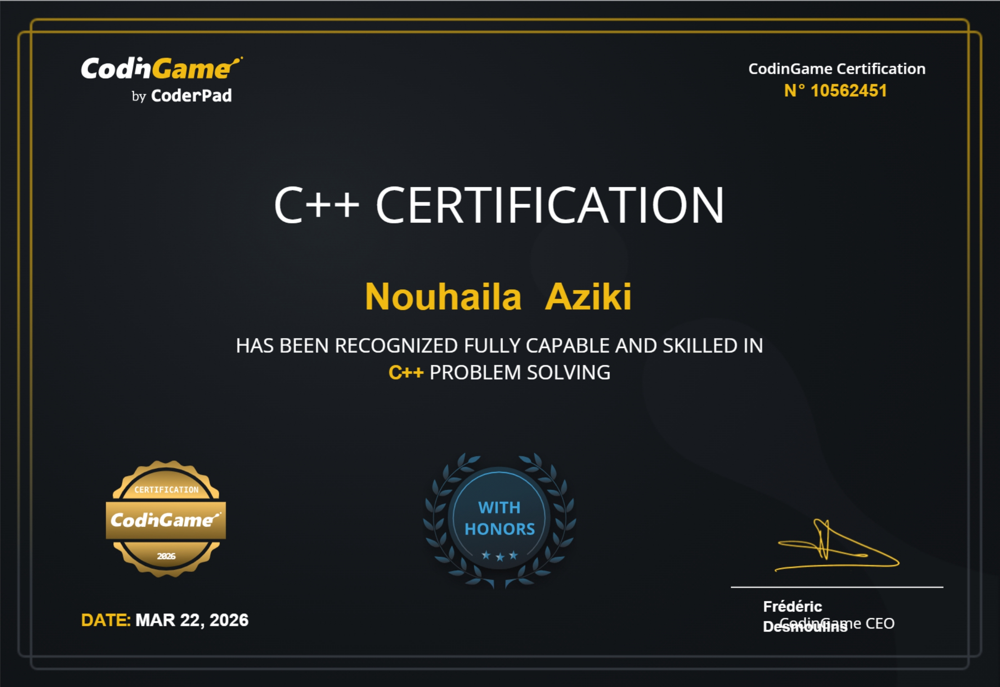
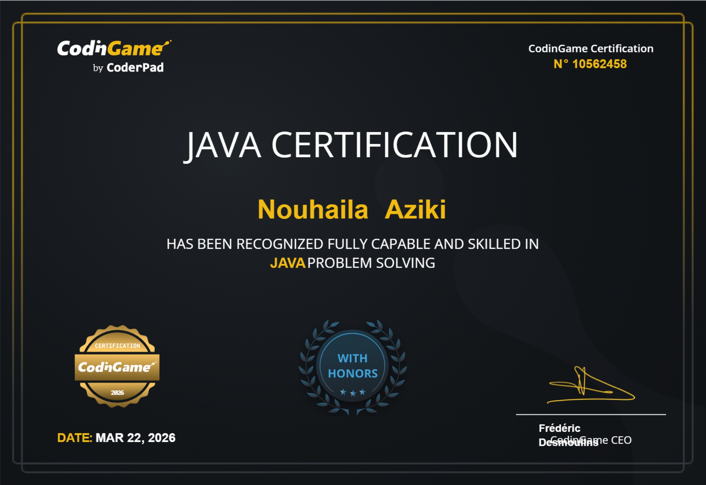

## Welcome to my GitHub space, where I share my coding projects and learning journey!

Software engineering student at 1337 (42 Network), passionate about building software and learning by doing. I have experience with full-stack development, system architecture, and problem-solving through hands-on projects and peer learning. I enjoy understanding how things work, building them from scratch, and improving my skills by working on real projects with others.

</a>

---

### Languages

 

### Frameworks & Libraries

 

### Tools & Technologies

---

### Some Certificates

| Certificate | Certificate |
|:---:|:---:|
|  |  |
|  |  |

---

### Contact Me

*Feel free to reach out to me!*

 

      

